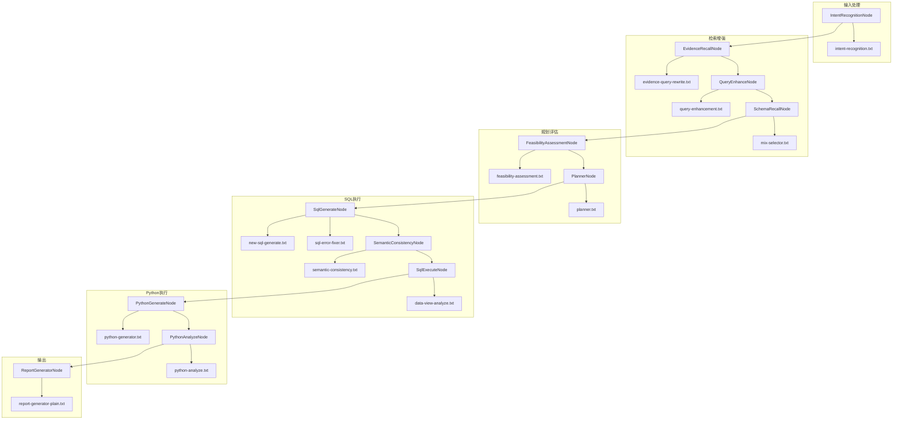

# DataAgent 项目 LLM 使用情况汇总

> 本文档整理了项目中所有使用 LLM 的地方及对应的提示词模板。

---

## 一、核心 LLM 服务架构

| 组件 | 路径 | 说明 |
|------|------|------|
| `LlmService` 接口 | `service/llm/LlmService.java` | 统一调用入口，支持 `call()`, `callSystem()`, `callUser()` |
| `StreamLlmService` | `service/llm/impls/StreamLlmService.java` | 流式调用实现 |
| `BlockLlmService` | `service/llm/impls/BlockLlmService.java` | 阻塞式调用实现 |
| `AiModelRegistry` | `service/aimodelconfig/AiModelRegistry.java` | 管理 ChatClient，支持动态切换模型 |

---

## 二、工作流节点 LLM 使用详情

| 节点 | 功能 | Prompt 模板文件 |
|------|------|----------------|
| **IntentRecognitionNode** | 判断闲聊/数据分析请求 | `intent-recognition.txt` |
| **EvidenceRecallNode** | 查询重写（口语→独立查询） | `evidence-query-rewrite.txt` |
| **QueryEnhanceNode** | 结合证据生成规范化查询 | `query-enhancement.txt` |
| **FeasibilityAssessmentNode** | 评估需求与数据匹配度 | `feasibility-assessment.txt` |
| **PlannerNode** | 生成分步骤执行计划 | `planner.txt` |
| **SqlGenerateNode** | 生成 SQL 语句 | `new-sql-generate.txt`, `sql-error-fixer.txt` |
| **SemanticConsistencyNode** | SQL 语义一致性校验 | `semantic-consistency.txt` |
| **SqlExecuteNode** | 执行 SQL 并推荐图表 | `data-view-analyze.txt` |
| **PythonGenerateNode** | 生成 Python 分析代码 | `python-generator.txt` |
| **PythonAnalyzeNode** | 分析 Python 执行结果 | `python-analyze.txt` |
| **ReportGeneratorNode** | 生成最终报告 | `report-generator-plain.txt` |

---

## 三、服务类 LLM 使用

| 服务 | 功能 | Prompt 来源 |
|------|------|------------|
| `Nl2SqlServiceImpl` | SQL 生成、语义校验、Schema 筛选 | `mix-selector.txt`, `new-sql-generate.txt` 等 |
| `SessionTitleService` | 异步生成会话标题 | 硬编码在代码中 |
| `AiSimulationCodeExecutorService` | 模拟 Python 执行（测试用） | 硬编码在代码中 |

### 3.1 SessionTitleService 硬编码 Prompt

```text
你是一名对话助手，请根据用户的第一条输入生成不超过20个字的会话标题。
使用中文输出，避免使用标点或引号，仅保留核心主题。
```

### 3.2 AiSimulationCodeExecutorService 硬编码 Prompt

```text
你将模拟Python的执行，根据我提供的代码和输入数据，并给出最终的数据结果。
在模拟运行时，请按照以下要求操作：
1. 仔细理解代码和输入数据的内容。
2. 输出模拟运行结果。
**要求**：仅输出模拟运行结果，禁止包含任何额外说明或自然语言。
```

---

## 四、Prompt 模板文件清单

所有模板位于 `data-agent-management/src/main/resources/prompts/`：

| 文件名 | 用途 |
|--------|------|
| `intent-recognition.txt` | 意图识别 |
| `evidence-query-rewrite.txt` | 查询重写 |
| `query-enhancement.txt` | 查询增强 |
| `feasibility-assessment.txt` | 可行性评估 |
| `planner.txt` | 计划生成 |
| `new-sql-generate.txt` | SQL 生成 |
| `sql-error-fixer.txt` | SQL 错误修复 |
| `semantic-consistency.txt` | 语义一致性校验 |
| `semantic-model.txt` | 语义模型构建 |
| `mix-selector.txt` | Schema 精细筛选 |
| `python-generator.txt` | Python 代码生成 |
| `python-analyze.txt` | Python 结果分析 |
| `report-generator-plain.txt` | 报告生成 |
| `data-view-analyze.txt` | 图表推荐 |
| `business-knowledge.txt` | 业务知识 |
| `agent-knowledge.txt` | 智能体知识 |
| `json-fix.txt` | JSON 修复 |

---

## 五、Prompt 管理机制

| 组件 | 路径 | 职责 |
|------|------|------|
| `PromptHelper` | `prompt/PromptHelper.java` | 静态方法构建各类 Prompt |
| `PromptConstant` | `prompt/PromptConstant.java` | 提供 PromptTemplate 实例 |
| `PromptLoader` | `prompt/PromptLoader.java` | 加载并缓存 `.txt` 模板 |
| `UserPromptConfig` | `entity/UserPromptConfig.java` | 用户自定义 Prompt 优化配置 |

### 5.1 PromptHelper 主要方法

| 方法 | 用途 |
|------|------|
| `buildIntentRecognitionPrompt()` | 意图识别 |
| `buildEvidenceQueryRewritePrompt()` | 查询重写 |
| `buildQueryEnhancePrompt()` | 查询增强 |
| `buildFeasibilityAssessmentPrompt()` | 可行性评估 |
| `buildNewSqlGeneratorPrompt()` | SQL 生成 |
| `buildSqlErrorFixerPrompt()` | SQL 错误修复 |
| `buildSemanticConsistenPrompt()` | 语义一致性 |
| `buildReportGeneratorPromptWithOptimization()` | 报告生成（支持优化配置） |
| `buildMixMacSqlDbPrompt()` | Schema 格式化 |
| `buildSemanticModelPrompt()` | 语义模型构建 |

---

## 六、LLM 调用方式总结

### 6.1 调用模式

1. **直接调用**: 节点直接注入 `LlmService`，调用 `call()`, `callSystem()`, `callUser()`
2. **服务封装**: 通过 `Nl2SqlService` 等封装服务间接调用
3. **流式响应**: 使用 `Flux<ChatResponse>` 处理流式输出
4. **阻塞调用**: 使用 `block()` 或 `collect()` 获取完整响应

### 6.2 配置方式

- **模型配置**: 通过 `ModelConfig` 表管理，支持动态切换
- **服务类型**: 通过 `llm-service-type` 配置选择 STREAM 或 BLOCK 模式
- **Prompt 优化**: 通过 `UserPromptConfig` 表支持用户自定义优化

---

## 七、节点与 Prompt 调用关系图



---

## 八、扩展说明

### 8.1 添加新的 LLM 调用点

1. 在 `prompts/` 目录下创建新的 `.txt` 模板文件
2. 在 `PromptConstant` 中添加对应的 `getXxxPromptTemplate()` 方法
3. 在 `PromptHelper` 中添加构建方法（如需动态参数）
4. 在节点或服务中注入 `LlmService` 并调用

### 8.2 自定义 Prompt 优化

通过 `UserPromptConfig` 表可以为特定智能体配置 Prompt 优化：

```sql
INSERT INTO user_prompt_config (agent_id, config_type, config_content)
VALUES ('your-agent-id', 'report-generator', '你的优化提示词内容');
```
