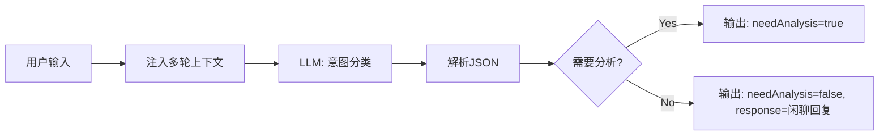
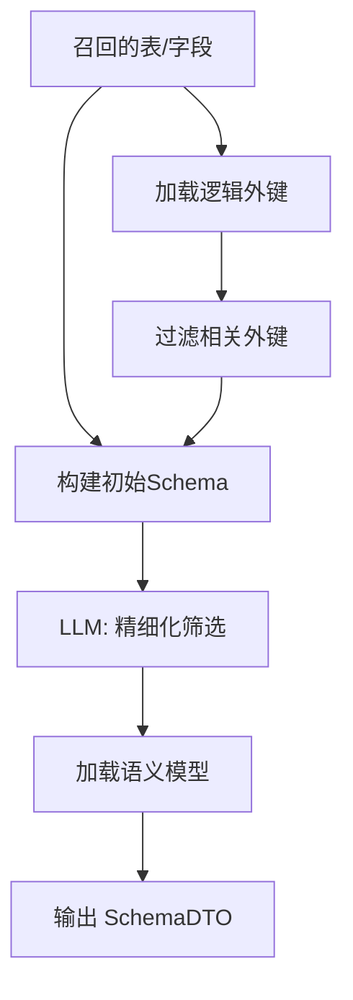
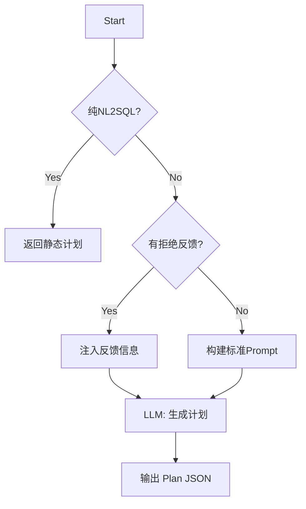
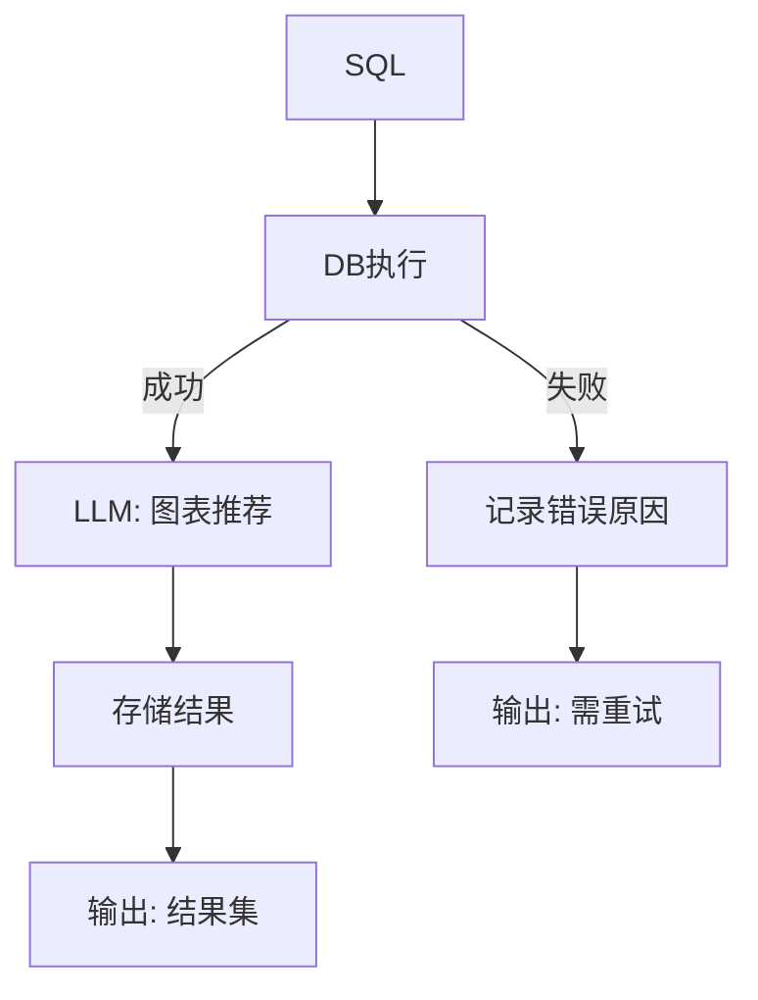
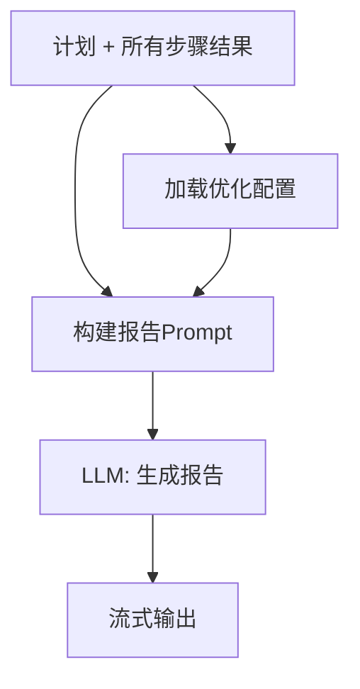

# DataAgent 核心节点逻辑蓝图

> 本文档将 StateGraph 工作流中的核心节点逻辑提炼为标准化的逻辑视图。这些蓝图旨在为其他项目提供架构参考，并作为 AI 自动生成代码的上下文输入。

---

## 目录

1. [输入处理阶段](#1-输入处理阶段)
2. [检索增强阶段](#2-检索增强阶段)
3. [规划与评估阶段](#3-规划与评估阶段)
4. [执行阶段 - SQL](#4-执行阶段---sql)
5. [执行阶段 - Python](#5-执行阶段---python)
6. [输出阶段](#6-输出阶段)

---

## 1. 输入处理阶段

### 1.1 IntentRecognitionNode (意图识别)

**核心职责**: 识别用户输入是闲聊还是数据分析请求，决定工作流走向。

**输入 (Inputs)**:
- `INPUT_KEY` (String): 用户原始输入
- `MULTI_TURN_CONTEXT` (String): 多轮对话历史上下文

**处理逻辑 (Logic Flow)**:
1. **上下文准备**: 提取用户输入和历史对话。
2. **Prompt构建**: 构造分类 Prompt，要求 LLM 判断意图并返回 JSON。
3. **LLM调用**: 执行分类任务。
4. **结果解析**: 将 LLM 输出解析为结构化对象。

**输出 (Outputs)**:
- `INTENT_RECOGNITION_NODE_OUTPUT` (DTO):
  - `needAnalysis` (Boolean): 是否进入分析流程
  - `responseToUser` (String): 闲聊时的直接回复

**逻辑视图**:


---

## 2. 检索增强阶段

### 2.1 EvidenceRecallNode (证据召回)

**核心职责**: 从向量库召回相关的业务术语和智能体知识，为后续生成提供上下文。

**输入 (Inputs)**:
- `INPUT_KEY` (String): 用户输入
- `AGENT_ID` (String): 当前智能体ID

**处理逻辑 (Logic Flow)**:
1. **查询重写 (Query Rewrite)**: 调用 LLM 将用户口语化输入重写为适合检索的独立查询 (Standalone Query)。
2. **并行检索 (Parallel Retrieval)**:
   - 通道 A: 检索 `BUSINESS_TERM` (通用业务术语)
   - 通道 B: 检索 `AGENT_KNOWLEDGE` (智能体专属知识，如 FAQ、文档)
3. **文档合并**: 将两路召回的文档去重合并。
4. **格式化**: 将文档元数据和内容拼接为标准证据格式 (`[来源:Title] Content`)。

**输出 (Outputs)**:
- `EVIDENCE` (String): 格式化后的证据文本块

**逻辑视图**:
```mermaid
flowchart TD
    Start[开始] --> Rewrite[LLM: 查询重写]
    Rewrite --> Parallel{并行检索}
    Parallel -->|通道A| VecBiz[向量库: 业务术语]
    Parallel -->|通道B| VecAgent[向量库: 智能体知识]
    VecBiz & VecAgent --> Merge[合并文档]
    Merge --> Format[格式化: [来源]内容]
    Format --> Output[输出 EVIDENCE]
```

### 2.2 QueryEnhanceNode (查询增强)

**核心职责**: 利用召回的证据，将用户查询中的业务术语翻译为更准确的描述。

**输入 (Inputs)**:
- `INPUT_KEY`: 用户输入
- `EVIDENCE`: 召回的证据
- `MULTI_TURN_CONTEXT`: 多轮上下文

**处理逻辑 (Logic Flow)**:
1. **Prompt构建**: 组合输入、证据和上下文。
2. **LLM调用**: 要求 LLM 理解业务术语，生成规范化查询 (Canonical Query)。
3. **结果解析**: 提取规范化查询。

**输出 (Outputs)**:
- `QUERY_ENHANCE_NODE_OUTPUT` (DTO):
  - `canonicalQuery` (String): 增强后的规范化查询

---

### 2.3 SchemaRecallNode (Schema召回)

**核心职责**: 根据增强后的查询，从数据库元数据中检索相关的表和字段。

**输入 (Inputs)**:
- `QUERY_ENHANCE_NODE_OUTPUT.canonicalQuery`: 规范化查询
- `AGENT_ID`: 智能体ID

**处理逻辑 (Logic Flow)**:
1. **表检索**: 基于查询内容，在向量库中检索相关的表文档 (`tableDocuments`)。
2. **表名提取**: 从召回文档中提取表名列表。
3. **字段检索**: 根据表名，检索这些表对应的所有字段文档 (`columnDocuments`)。
4. **空结果处理**: 如果未召回表，返回提示信息并终止。

**输出 (Outputs)**:
- `TABLE_DOCUMENTS_FOR_SCHEMA_OUTPUT` (List<Document>): 相关表文档
- `COLUMN_DOCUMENTS__FOR_SCHEMA_OUTPUT` (List<Document>): 相关字段文档

---

### 2.4 TableRelationNode (表关系分析)

**核心职责**: 构建完整的数据库 Schema，处理物理外键和逻辑外键，并进行精细化筛选。

**输入 (Inputs)**:
- `TABLE_DOCUMENTS_FOR_SCHEMA_OUTPUT`: 表文档
- `COLUMN_DOCUMENTS__FOR_SCHEMA_OUTPUT`: 字段文档
- `AGENT_ID`: 智能体ID
- `EVIDENCE`: 证据

**处理逻辑 (Logic Flow)**:
1. **逻辑外键加载**: 查询 `logical_relation` 表，获取用户配置的虚拟外键。
2. **外键过滤**: 只保留与召回表相关的逻辑外键。
3. **Schema构建**: 
   - 解析表/字段文档构建基础 Schema。
   - 合并物理外键和逻辑外键。
4. **精细筛选 (Fine Select)**: 调用 LLM (Nl2SqlService) 从构建的 Schema 中进一步筛选出真正需要的表和字段，减少 Token 消耗。
5. **语义模型加载**: 加载选中表的语义模型描述。

**输出 (Outputs)**:
- `TABLE_RELATION_OUTPUT` (SchemaDTO): 最终选定的 Schema 对象
- `GENEGRATED_SEMANTIC_MODEL_PROMPT` (String): 语义模型提示词
- `DB_DIALECT_TYPE` (String): 数据库方言

**逻辑视图**:


---

## 3. 规划与评估阶段

### 3.1 FeasibilityAssessmentNode (可行性评估)

**核心职责**: 评估当前 Schema 和证据是否足以回答用户问题。

**输入 (Inputs)**:
- `QUERY_ENHANCE_NODE_OUTPUT.canonicalQuery`: 规范化查询
- `TABLE_RELATION_OUTPUT`: Schema
- `EVIDENCE`: 证据

**处理逻辑 (Logic Flow)**:
1. **评估**: 调用 LLM 分析需求与数据供给的匹配度。
2. **分类**:
   - 可行 (Feasible): 继续
   - 缺失信息 (Missing Info): 需要澄清
   - 无法回答 (Impossible): 终止

**输出 (Outputs)**:
- `FEASIBILITY_ASSESSMENT_NODE_OUTPUT` (String): 评估结果

---

### 3.2 PlannerNode (计划生成)

**核心职责**: 生成分步骤的执行计划 (Chain of Thought)。

**输入 (Inputs)**:
- `QUERY_ENHANCE_NODE_OUTPUT.canonicalQuery`: 查询
- `TABLE_RELATION_OUTPUT`: Schema
- `EVIDENCE`: 证据
- `PLAN_VALIDATION_ERROR` (String, Optional): 上一次计划的错误/拒绝原因 (用于重规划)

**处理逻辑 (Logic Flow)**:
1. **模式检查**: 如果是 `IS_ONLY_NL2SQL` 模式，直接返回预定义单步计划。
2. **上下文组装**: 拼接 Schema、证据、语义模型。
3. **重规划判断**: 如果存在 `PLAN_VALIDATION_ERROR` (来自人工拒绝或校验失败)，在 Prompt 中注入错误信息，要求 LLM 修正。
4. **计划生成**: 调用 LLM 生成 JSON 格式的执行计划 (`Plan` 对象)。

**输出 (Outputs)**:
- `PLANNER_NODE_OUTPUT` (String/JSON): 执行计划

**逻辑视图**:


### 3.3 PlanExecutorNode (计划执行/调度)

**核心职责**: 解析计划，验证有效性，并调度下一个执行节点。

**输入 (Inputs)**:
- `PLANNER_NODE_OUTPUT`: 计划 JSON
- `PLAN_CURRENT_STEP`: 当前步骤号 (默认为 1)
- `HUMAN_REVIEW_ENABLED`: 是否开启人工审核

**处理逻辑 (Logic Flow)**:
1. **计划解析与验证**: 解析 JSON，验证步骤结构的完整性。
2. **人工审核拦截**: 如果 `HUMAN_REVIEW_ENABLED=true`，将下一节点指向 `HUMAN_FEEDBACK_NODE`。
3. **步骤调度**:
   - 获取当前步骤 (`currentStep`)。
   - 读取该步骤的 `toolToUse` (如 `sql_generate_node`)。
   - 设置 `PLAN_NEXT_NODE` 为该工具节点。
4. **完成判断**: 如果当前步骤号 > 总步骤数，指向 `REPORT_GENERATOR_NODE` 或结束。

**输出 (Outputs)**:
- `PLAN_NEXT_NODE` (String): 下一个节点名称
- `PLAN_VALIDATION_STATUS` (Boolean): 验证状态

---

### 3.4 HumanFeedbackNode (人工反馈)

**核心职责**: 处理用户对计划的审批操作。

**输入 (Inputs)**:
- `HUMAN_FEEDBACK_DATA`: 用户反馈数据
- `PLAN_REPAIR_COUNT`: 当前修复次数

**处理逻辑 (Logic Flow)**:
1. **死循环保护**: 检查 `PLAN_REPAIR_COUNT`，超过 3 次强制结束。
2. **等待反馈**: 如果没有反馈数据，挂起流程 (`WAIT_FOR_FEEDBACK`)。
3. **反馈处理**:
   - **同意**: 路由至 `PLAN_EXECUTOR_NODE` 继续执行，关闭审核开关。
   - **拒绝**: 路由至 `PLANNER_NODE` 重新规划，增加修复次数，记录拒绝原因。

**输出 (Outputs)**:
- `human_next_node`: 下一节点
- `PLAN_VALIDATION_ERROR`: 拒绝原因 (如果是拒绝)

---

## 4. 执行阶段 - SQL

### 4.1 SqlGenerateNode (SQL生成)

**核心职责**: 根据当前步骤指令生成 SQL 语句。

**输入 (Inputs)**:
- `PLAN_CURRENT_STEP`: 当前步骤
- `TABLE_RELATION_OUTPUT`: Schema
- `SQL_REGENERATE_REASON`: 重试原因 (可选)

**处理逻辑 (Logic Flow)**:
1. **重试检查**: 检查 `SQL_GENERATE_COUNT`，超限则放弃。
2. **Prompt构建**: 获取当前步骤的 `instruction`。
3. **生成模式**:
   - **首次生成**: 标准 Prompt。
   - **重试生成**: 注入 `SQL_REGENERATE_REASON` (执行报错或语义校验失败信息) 和 原 SQL。
4. **LLM调用**: 生成 SQL。

**输出 (Outputs)**:
- `SQL_GENERATE_OUTPUT` (String): 生成的 SQL
- `SQL_GENERATE_COUNT` (Int): 尝试次数 + 1

### 4.2 SemanticConsistencyNode (语义一致性校验)

**核心职责**: 验证生成的 SQL 是否符合用户意图和 Schema 规范。

**输入 (Inputs)**:
- `SQL_GENERATE_OUTPUT`: SQL
- `QUERY_ENHANCE_NODE_OUTPUT.canonicalQuery`: 用户意图
- `TABLE_RELATION_OUTPUT`: Schema

**处理逻辑 (Logic Flow)**:
1. **校验**: 调用 LLM 对比 SQL 和用户意图/Schema。
2. **判断**:
   - **通过**: 输出 `true`。
   - **不通过**: 输出 `false` 并附带原因。

**输出 (Outputs)**:
- `SEMANTIC_CONSISTENCY_NODE_OUTPUT` (Boolean): 是否通过
- `SQL_REGENERATE_REASON` (DTO): 失败原因 (如果不通过)

### 4.3 SqlExecuteNode (SQL执行)

**核心职责**: 在数据库中执行 SQL，并处理结果。

**输入 (Inputs)**:
- `SQL_GENERATE_OUTPUT`: SQL
- `AGENT_ID`: 智能体ID

**处理逻辑 (Logic Flow)**:
1. **执行**: 获取数据源连接，执行 SQL。
2. **图表推荐 (可选)**: 调用 LLM 分析结果集，推荐 ECharts 图表配置 (`enrichResultSetWithChartConfig`)。
3. **结果存储**:
   - 将结果集 JSON 存入 `SQL_EXECUTE_NODE_OUTPUT` (用于报告)。
   - 将结果集 List 存入 `SQL_RESULT_LIST_MEMORY` (用于 Python 节点)。
4. **错误处理**: 执行异常则记录错误，触发重试逻辑。

**输出 (Outputs)**:
- `SQL_EXECUTE_NODE_OUTPUT` (Map): 步骤结果映射
- `SQL_RESULT_LIST_MEMORY` (List): 结果集数据
- `SQL_REGENERATE_REASON`: 错误信息 (如果失败)

**逻辑视图**:


---

## 5. 执行阶段 - Python

### 5.1 PythonGenerateNode (Python生成)

**核心职责**: 生成用于数据分析的 Python 代码。

**输入 (Inputs)**:
- `TABLE_RELATION_OUTPUT`: Schema
- `SQL_RESULT_LIST_MEMORY`: SQL 执行结果数据 (Sample)
- `PYTHON_IS_SUCCESS`: 上次是否成功

**处理逻辑 (Logic Flow)**:
1. **错误反馈**: 如果 `PYTHON_IS_SUCCESS=false`，注入上次代码和错误信息。
2. **Prompt构建**: 包含 Schema、数据样例、内存限制、超时限制。
3. **LLM调用**: 生成 Python 代码。

**输出 (Outputs)**:
- `PYTHON_GENERATE_NODE_OUTPUT` (String): Python 代码

### 5.2 PythonExecuteNode (Python执行)

**核心职责**: 在隔离环境 (Docker) 中执行 Python 代码。

**输入 (Inputs)**:
- `PYTHON_GENERATE_NODE_OUTPUT`: Python 代码
- `SQL_RESULT_LIST_MEMORY`: 完整数据

**处理逻辑 (Logic Flow)**:
1. **任务提交**: 将代码和数据提交给 `CodePoolExecutorService`。
2. **执行**: Docker 容器运行代码。
3. **结果检查**:
   - **成功**: 解析 StdOut。
   - **失败**: 检查重试次数。
     - 未超限: 标记失败，触发重生成。
     - 已超限: 开启 **降级模式** (`PYTHON_FALLBACK_MODE=true`)，允许流程继续但不含高级分析。

**输出 (Outputs)**:
- `PYTHON_EXECUTE_NODE_OUTPUT` (String): 执行结果/错误信息
- `PYTHON_IS_SUCCESS` (Boolean): 状态
- `PYTHON_FALLBACK_MODE` (Boolean): 是否降级

### 5.3 PythonAnalyzeNode (Python分析)

**核心职责**: 对 Python 运行结果进行自然语言总结。

**输入 (Inputs)**:
- `PYTHON_EXECUTE_NODE_OUTPUT`: 运行结果
- `PYTHON_FALLBACK_MODE`: 是否降级

**处理逻辑 (Logic Flow)**:
1. **降级检查**: 如果 `PYTHON_FALLBACK_MODE=true`，返回固定致歉话术。
2. **分析**: 调用 LLM 根据用户问题和 Python 输出生成分析结论。
3. **存储**: 将分析结果存入 `SQL_EXECUTE_NODE_OUTPUT`。

**输出 (Outputs)**:
- `PYTHON_ANALYSIS_NODE_OUTPUT` (String): 分析结论

---

## 6. 输出阶段

### 6.1 ReportGeneratorNode (报告生成)

**核心职责**: 汇总所有步骤的执行结果，生成最终报告。

**输入 (Inputs)**:
- `PLANNER_NODE_OUTPUT`: 完整计划
- `SQL_EXECUTE_NODE_OUTPUT`: 所有步骤的执行结果 (SQL结果/Python分析)
- `AGENT_ID`: 智能体ID

**处理逻辑 (Logic Flow)**:
1. **上下文组装**:
   - 用户原始需求
   - 执行计划概述 (思考过程)
   - 详细执行步骤与结果
2. **配置加载**: 加载 `report-generator` 类型的 `UserPromptConfig` (优化提示词)。
3. **LLM调用**: 生成最终的 Markdown/HTML 报告。

**输出 (Outputs)**:
- `RESULT` (String): 最终报告内容

**逻辑视图**:

